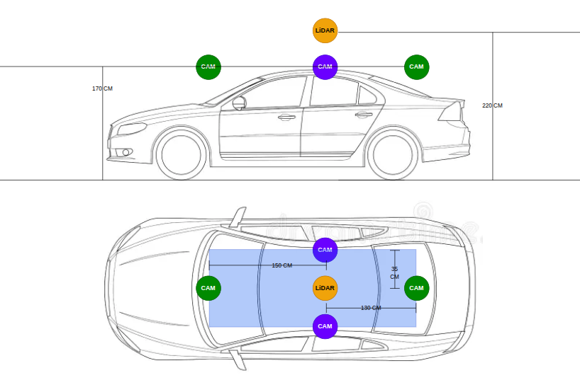

# CARLA Fusion Dataset Generator

This repository provides a CARLA-based dataset generator for multi-sensor perception pipeline.

The purpose is to generate synchronized camera and LiDAR data from CARLA using a configurable sensor rig. The generated data can be used for synthetic camera/LiDAR fusion experiments in autonomous driving.

The repository contains:


- gen_carla.py: main dataset generation script
- sim_carla.py: sensor rig and simulation definition
- Dockerfile: environment
- assets/


## Sensor rig

The default setup uses 4 cameras and one LiDAR sensor.

The sensor rig can be changed from:

```text
sim_carla.py
```



Typical parameters to modify in `sim_carla.py`:

- camera positions and rotations
- camera resolution
- camera field of view
- LiDAR position and height
- LiDAR channels
- LiDAR range
- LiDAR points per second
- simulation FPS and sensor tick
- map

## Docker?

You have two choices:
- use your PC (not recommended if your purpose is high quality data)
- use cloud, in this case is recommended and the used service is RunPod (cheap and simple)

The environment includes:

- CARLA 0.9.16
- Python 3.10 (Do not use another version because Python API needs this)
- CARLA Python API
- required Python packages
- SSH startup support for RunPod
- the generator scripts inside `/workspace/scripts`

I suggest you to use the docker image in dockerhub for experiment:

```bash
docker pull arshemii/carla916:vrepo
```

This image is intended to be used directly on RunPod or another GPU cloud provider.

## Why RunPod?

CARLA rendering and dataset generation can be heavy:
- 4 cameras + LiDAR
- Many road users

A local laptop GPU may be enough for very small tests, but larger dataset generation is better done on a stronger cloud GPU.

RunPod is useful because it allows you to:

- run the prepared Docker image directly
- use stronger GPUs such as RTX 4090
- attach persistent network storage
- keep generated data after stopping the Pod
- use SSH or web terminal for operation

## Recommended RunPod setup

### 1. Create a network volume

Before creating the Pod, create a RunPod network volume.

Recommended initial size:

```text
50 GB # You can increase if need more than 2000 samples of high quality
```
Consider also:
- The network volume is charged as storage (Monthly, but cheap)
- The selected region/datacenter also affects which GPU Pods are available later, so choose a region where your target GPU is available.

Use this exact mount path as it is the same as sim_carla.py configurations:

```text
/data_ssd
```

The generator will save data there.

### 2. Create a custom template

Create a new RunPod template with these settings:

```text
Container image:
arshemii/carla916:vrepo

Container start command:
/start.sh

Network volume mount path:
/data_ssd

Container disk:
30 GB or more
```

Least environment variables:

```text
NVIDIA_VISIBLE_DEVICES=all
NVIDIA_DRIVER_CAPABILITIES=all
```

If you want to use direct SSH/SCP, expose TCP port:

```text
22
```

Save the template.

### 3. Create a Pod

Go to the Pods page and select the network volume you created. RunPod will then show GPU instances available for that volume/region.

Recommended GPU:

```text
RTX 4090
```

Recommended GPU count:

```text
1
```

One RTX 4090 is usually enough for CARLA dataset generation with this setup.

After selecting the GPU, change the template to your saved custom template.

Before starting the Pod, check again that the network volume is mounted at:

```text
/data_ssd
```

Then start the Pod.

## Connecting to the Pod

You can use either:

- RunPod web terminal
- SSH from your local machine

The web terminal is usually easier and faster.
SSH is useful for copying files with `scp` or `rsync`.

After connecting, check that the environment is correct:

```bash
ls /workspace
ls /workspace/scripts
python --version
nvidia-smi
```

You should see the CARLA files in `/workspace`, and the scripts in:

```text
/workspace/scripts
```

## Running CARLA

You need two terminals.

### Terminal 1: start the CARLA server

Run:

```bash
su -s /bin/bash carla -c 'cd /workspace && ./CarlaUE4.sh -RenderOffScreen -nosound -quality-level=Epic -carla-rpc-port=2000 -stdout -FullStdOutLogOutput'
```

Important: CARLA must be started as the `carla` user, not as `root`.

Keep this terminal open.

### Terminal 2: run the dataset generator

In a second terminal, run:

```bash
cd /workspace

python scripts/gen_carla.py \
  --map Town10HD \
  --data-name 10hd1 \
  --frame 200 \
  --cars 120 \
  --humans 45
```

The generated data will be saved under:

```text
/data_ssd/10hd1
```

## Generator arguments

The main script supports the following basic flags.

### `--map`

CARLA map name.

Examples:

```bash
--map Town10HD
```

or:

```bash
--map Town10HD_Opt
```

### `--data-name`

Name of the output dataset folder.

Example:

```bash
--data-name 10hd1
```

Output path:

```text
/data_ssd/10hd1
```

### `--frame`

Number of frames to record.

Example:

```bash
--frame 200
```

### `--cars`

Number of NPC vehicles.

Example:

```bash
--cars 120
```

### `--humans`

Number of pedestrians.

Example:

```bash
--humans 45
```

## Example runs

Small smoke test:

```bash
python scripts/gen_carla.py \
  --map Town01_Opt \
  --data-name smoke_test \
  --frame 5 \
  --cars 10 \
  --humans 2
```

Town10HD test:

```bash
python scripts/gen_carla.py \
  --map Town10HD \
  --data-name town10_test \
  --frame 50 \
  --cars 60 \
  --humans 20
```

Larger generation:

```bash
python scripts/gen_carla.py \
  --map Town10HD \
  --data-name 10hd1 \
  --frame 200 \
  --cars 120 \
  --humans 45
```

## Changing the sensor rig

The sensor rig is configured in:

```text
sim_carla.py
```

Edit this file if you want to change:

- number of cameras
- camera resolution
- camera field of view
- camera mounting position
- LiDAR position
- LiDAR range
- LiDAR point density
- output directory
- capture rate

After editing, run the generator again.

## Downloading generated data

The data is stored on the RunPod network volume:

```text
/data_ssd

```

## Costs

When generation is finished:

1. Stop or delete the GPU Pod to stop GPU compute charges.
2. Keep the network volume only if you still need the data.
3. Delete the network volume after downloading the data if you do not need it anymore.

The total cost using NVIDIA 4090 for highest quality of data for 2000 simulation steps (200 frames with 10 steps intervals) will be around 2 Euros for generation.

## Contact
For any questions, contact arshemii1373@gmail.com
